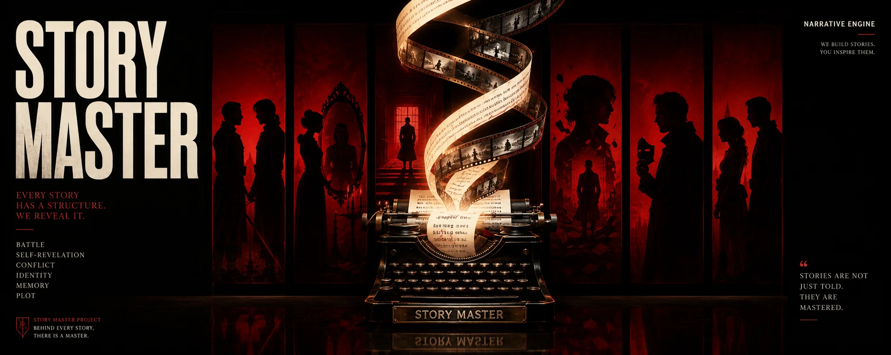
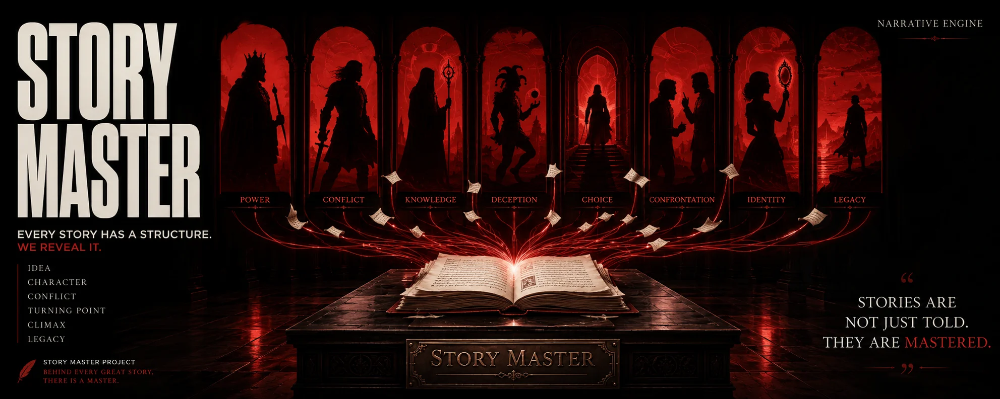
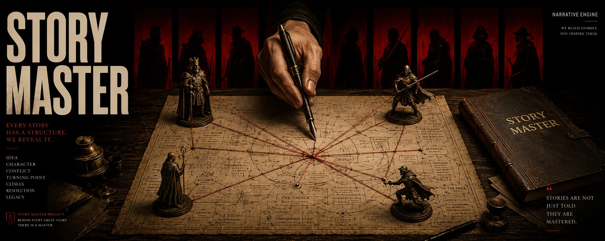

# story-master

<div align="center">

**English** · [简体中文](./README.zh-CN.md)

**Character-driven structures, organic plots, and thematic architecture based on John Truby's *The Anatomy of Story*.**




[](https://buymeacoffee.com/pappydaddy)

</div>

---

`story-master` is an agent skill and workspace that helps you build stories from the inside out. It translates the story development system from John Truby's book, *The Anatomy of Story*, into a structured, interactive format for writing novels, screenplays, and narrative design.

Instead of pasting together generic plot beats, it guides you to build character networks, moral arguments, spatial symbols, and scene structures that follow a single causal line.

> A plot is not a sequence of events. It is the footprint of a character's moral and psychological transformation.

---

## Organic narrative architecture

Formulaic templates often produce predictable, plot-driven stories. This skill focuses on building organic narratives by focusing on four core areas:

- **Character-moral alignment**: The protagonist starts with a psychological and moral weakness that hurts others. This makes their final transformation feel earned.
- **Four-corner opposition**: A network of rivals competing for the same goal with different values, avoiding simple good versus evil dynamics.
- **Double reversal**: Both the protagonist and the primary antagonist experience a self-revelation at the climax to deliver a nuanced moral theme.
- **Three-track dialogue**: Dialogues that carry plot progression, thematic arguments, and subtext at the same time.

---

## What you get



Using this skill, the AI agent will guide you through:
- A structured premise analysis and design principle setup.
- Character webs mapped with four-corner opposition matrices.
- Step outlines scaled for short stories (7 key steps) or long novels/screenplays (22 steps).
- Multi-track scene weaving and subtext-rich symphonic dialogues.

---

## How it works: the interactive stage-gate protocol

To keep the AI from rushing or collapsing the outline, `story-master` uses a stage-gate protocol. The agent pauses and waits for your confirmation at each step before moving on:



```text
PREMISE & DESIGN PRINCIPLE -> 7 KEY STEPS -> CHARACTER WEB & OPPOSITION -> STEP OUTLINING -> SCENE WEAVING & DRAFTING
```

1. **Gate 1: Premise and Design Principle** (Lock in the core idea, the internal geometry of the story, and structural challenges)
2. **Gate 2: Seven Key Steps** (Build the spine from the opening weakness to the final self-revelation)
3. **Gate 3: Character Web and Four-Corner Opposition** (Construct the rival network and define competing values)
4. **Gate 4: Outlining** (Map the plot beats, using 7 steps for short stories under 5,000 words or 22 steps for long novels and screenplays)
5. **Gate 5: Scene Weaving and Symphonic Dialogue** (Write the scenes and edit subtext-rich dialogue)

---

## Quick start

### 1. Installation

**Option A: Install via command line (Easiest)**
Run the automated installer command:
```bash
npx skills add idonafraid-create/story-master -y -g
```

**Option B: Manual clone**
Clone the repository directly into your agent's skills directory:
```powershell
# Windows PowerShell
git clone https://github.com/idonafraid-create/story-master.git D:\path\to\.agent\skills\story-master
```
```bash
# macOS / Linux
git clone https://github.com/idonafraid-create/story-master.git ~/.agent/skills/story-master
```

**Option C: Developer mode (Linking)**
If you are developing the skill locally, clone it to a working folder, then link it to your agent's skill directory:
```powershell
# Windows PowerShell (Junction)
New-Item -ItemType Junction `
  -Path D:\path\to\.agent\skills\story-master `
  -Target D:\path\to\story-master
```
```bash
# macOS / Linux (Symbolic Link)
ln -s ~/path/to/story-master ~/.agent/skills/story-master
```

### 2. Usage

Directly prompt your AI agent using Truby terms or storytelling goals. For example:

```text
Use story-master to help me design a premise for a sci-fi novel about cybernetic inequality.

I want to outline my screenplay's second act using story-master's 22 steps.

Analyze my protagonist's character web and set up a four-corner opposition matrix using story-master.
```

---

## Documentation map

| File | Purpose |
|---|---|
| [SKILL.md](./SKILL.md) | Main Agent workflow rules, scaling guidelines, and quality gates. |
| [premise_7steps.md](./references/premise_7steps.md) | 10 steps to refine premise and the 7 key structural steps. |
| [character_theme.md](./references/character_theme.md) | Archetype directories, four-corner opposition, and double reversal design. |
| [world_symbols.md](./references/world_symbols.md) | Symbol networks, time structures, and spatial storytelling. |
| [plot_22steps.md](./references/plot_22steps.md) | In-depth breakdown of the 22 plot steps. |
| [scene_dialogue.md](./references/scene_dialogue.md) | Scene weaving techniques and three-track symphonic dialogue. |

---

## License

[MIT](./LICENSE)
