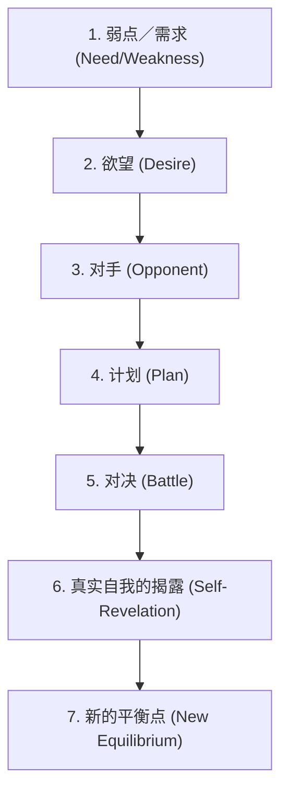

# 故事前提与结构七大关键步骤

本文件详细说明约翰·特鲁比（John Truby）故事写作体系中的“故事前提”与“故事结构七大关键步骤”。

---

## 一、故事前提 (Story Premise)

故事前提就是用一句话交代你的故事。它是角色和剧情最简单的组合，包含启动行动的某个事件、主要角色的某种感受，以及故事结局的某种含义。

### 发展故事前提的 10 个步骤

#### 1. 写出能改变你人生的东西 (Write something that can change your life)
* 找出对自己而言真正重要的主题，并以此进行个人化的创作。
* 练习 1：“愿望清单”——记下所有你想在银幕或书中看到的事物。
* 练习 2：“故事前提清单”——把想过的所有故事前提，各自用“一句话”写下来，并寻找重复出现的核心元素（特定角色类型、观点、类型或主题）。

#### 2. 探索有哪些可能性 (Explore possibilities)
* 不要一开始就跳进单一可能。问自己：“假如这样，结果会如何？”（What if?）
* 寻找故事意念中隐含的各种可能途径，放任心智去探索，将愚蠢的意念转化为突破。

#### 3. 找出故事面临的挑战与问题 (Identify challenges & problems)
* 每个故事前提都有其与生俱来的结构问题。在动手写作前，先找出这个前提的挑战。
* 例如：如果前提是“一个侦探调查谋杀案”，挑战在于如何避免流于普通的侦探套路，以及如何在结尾揭露更大的罪行。

#### 4. 找出故事的设计原则 (Identify design principles)
* 设计原则是故事的“内部几何学”，它指明了故事如何有机运作。
* **公式：设计原则 = 故事原创意念 + 运作形式。**
* 例如：《窈窕淑男》的设计原则是“让一个男性沙文主义者乔装成女人，借此体验女性的处境，进而成为一个更好的男人”。

#### 5. 确定故事意念中最好的角色 (Identify best characters)
* 永远从故事前提中直接汲取角色。
* 确保主角是故事世界中最有趣、最能展现核心冲突的角色。

#### 6. 思索中心冲突 (Think about central conflict)
* 谁与主角对抗？他们在争夺什么？
* 冲突必须是“一对一”的正面交锋，且双方都在竞逐同一个目标。

#### 7. 思考单一因果关系线 (Think about single causal line)
* 故事必须有一条单一的因果链。A 导致 B，B 导致 C，最终引向结局。
* 避免散漫的、片段式的事件堆叠。

#### 8. 确定主角可能的角色转变 (Determine character change)
* 主角在故事开头的状态（弱点）与结尾的状态（真实自我的揭露）之间的差距，就是角色转变的幅度。
* 角色转变应该是从“被动/受奴役”走向“主动/自由”，或相反。

#### 9. 找出主角可能的道德抉择 (Identify moral decisions)
* 主角在故事结尾必须在两种行动中做出抉择，这两种行动代表了两种对立的价值取向。

#### 10. 提出关键的大问题 (Propose key questions)
* 这是推动整个故事前进的戏剧性大问题 (Central Dramatic Question)。
* 例如：“麦可能否在不揭穿自己是男人的情况下，赢得茱莉的芳心？”

---

## 二、故事结构七大关键步骤 (7 Key Steps)

这七大步骤是故事的 DNA，也是隐含于故事表象之下的戏剧信息密码。

### 1. 弱点／需求 (Weakness / Need)
* **弱点：** 主角从故事开头就深受某个或多个严重人格缺陷牵制。
* **需求：** 主角必须克服弱点，学习如何善待他人（道德需求）或克服内心障碍（心理需求），才能拥有更好的人生。
* **难题 (Problem)：** 主角从第一页开始就陷入的具体危机，是弱点的外部彰显。
* **关键规则：**
  1. 主角在开头不该察觉自己的需求，而是在“真实自我的揭露”时才恍然大悟。
  2. 务必赋予主角**心理层面**与**道德层面**的需求。道德需求意味着主角在开头的行为伤害了至少一个人。

### 2. 欲望 (Desire)
* **欲望：** 主角在故事中的具体外在目标。它是观众“依循前进”的故事轨迹。
* **与需求的区别：** 需求是内在的（主角不知道），欲望是外在的（主角非常清楚且全力追求）。
* **关键规则：** 欲望必须是具体、明确的，且在故事进行中重要性与风险要逐步提升，不能在中途随意更换全新目标。

### 3. 对手 (Opponent)
* **对手：** 阻碍主角达成欲望的角色。
* **关键规则：** 对手必须与主角竞逐**同一个目标**，如此双方才会正面冲突。如果目标不同，两人就无法产生有机的、持续的对抗。

### 4. 计划 (Plan)
* **计划：** 主角用来克服对手、达成目标的具体指引或策略。
* **关键规则：** 主角最初的计划几乎总是失败，因为对手此时太强。这迫使主角深入发掘内心，调整策略。

### 5. 对决 (Battle)
* **对决：** 主角与对手之间的最终冲突，决定谁能获胜。
* **关键规则：** 对决不应只是单纯的暴力，而是双方价值取向和信念的交锋。

### 6. 真实自我的揭露 (Self-Revelation)
* **真实自我揭露：** 对决的严酷考验迫使主角剥除表象，诚实面对自己，产生心理与道德上的重大发现。
* **关键规则：** 不要让主角用说教的对白直接说出启示，而应通过其随后的决定与行动来暗示。

### 7. 新的平衡点 (New Equilibrium)
* **新的平衡点：** 欲望消失，每件事回复正常，但主角已因“真实自我的揭露”抵达了更高（正面转变）或更低（悲剧毁灭）的人生层次。
